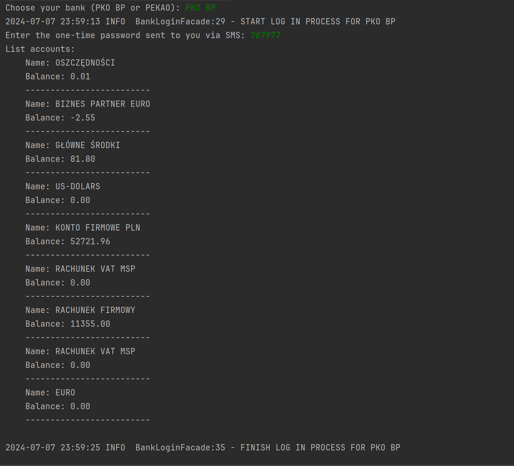

# Kontomatik-Challenge
> Recruitment task for the company. A web scraper that logs into your bank and displays your account balance.

## Table of Contents
* [General Info](#general-information)
* [Technologies Used](#technologies-used)
* [Features](#features)
* [Screenshots](#screenshots)
* [Setup](#setup)
* [Usage](#usage)
* [Project Status](#project-status)
* [Room for Improvement](#room-for-improvement)

## General Information
- The project is written in java 21
- A solution was provided that allows you to log in to the bank and display your account balance

## Technologies Used
- Java - version 21

## Features
List the ready features here:
- Logging into bank account
- Printing account balance

## Code coverage
>95%

## Screenshots

## Setup

For building and running the application you need:

- [JDK 21](https://www.oracle.com/pl/java/technologies/downloads/)

## Usage

Build and run application:

`./mvnw clean install exec:java`

## Project Status
Project is:  _complete_

## Room for Improvement
Add other banks such as Millennium or Nordea.

